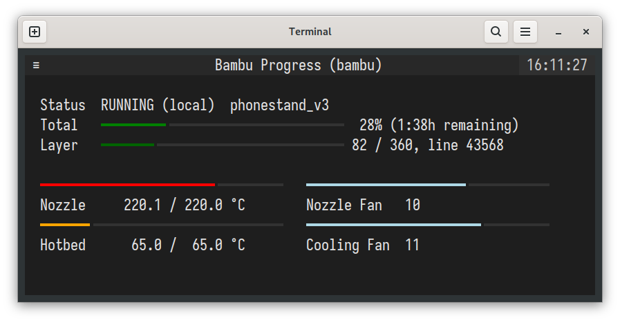

# bambu-progress

Simple script using [bambu-connect](https://github.com/mattcar15/bambu-connect) and [textual](https://github.com/Textualize/textual) to show your BambuLab printer's current status in a terminal window with pretty progress bars and stuff.

Put `BAMBU_HOSTNAME`, `BAMBU_ACCESS_CODE` and `BAMBU_SERIAL` in a `.env` file. See [bambu-connect's instructions](https://github.com/mattcar15/bambu-connect?tab=readme-ov-file#setup) on how to get those.
